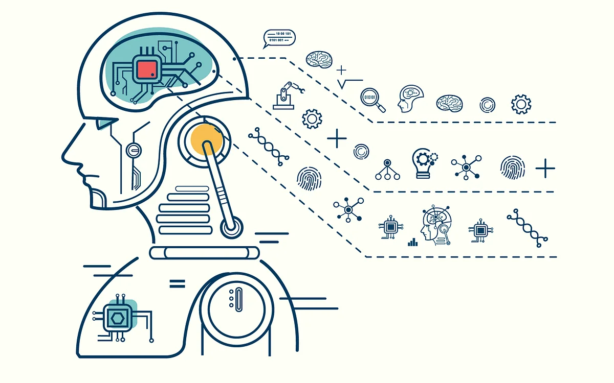
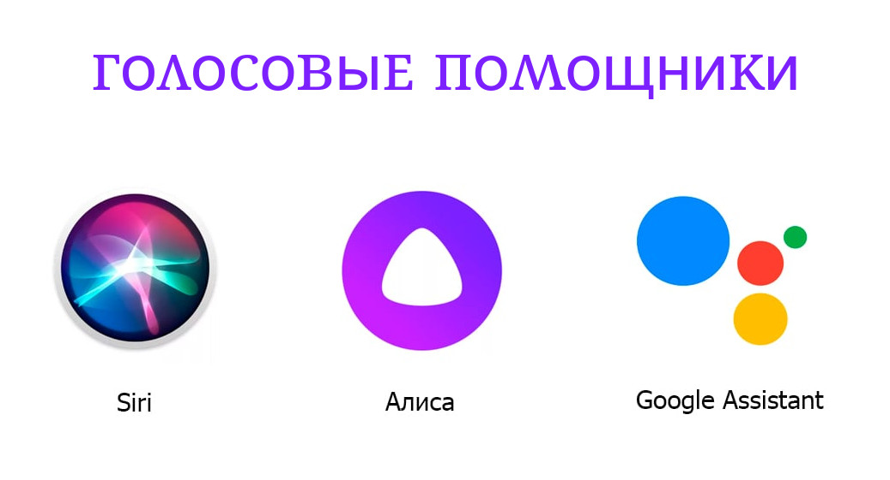

# Введение

**Искусственный интеллект** — это захватывающая научная дисциплина, которая исследует пути наделения компьютеров интеллектом, способным на творческие и аналитические задачи, подобные тем, что под силу человеку. Представьте себе компьютер, который не просто считает числа, но может понимать ваши шутки, писать стихи или создавать музыку.

Первоначально компьютеры были изобретены _Чарльзом Бэббиджем_ для выполнения строгих последовательностей операций над числами, следуя четко определённому алгоритму. В наше время компьютеры стали невероятно мощными и сложными, но основная идея осталась прежней: управляемые вычисления. Таким образом, если мы знаем точную последовательность шагов для достижения цели, то можем запрограммировать компьютер для выполнения этой задачи.

Представьте себе мир, где компьютеры понимают, что вы чувствуете, и помогают вам находить решения, которые раньше казались невозможными. Это не просто вычислительные машины, а партнёры в интеллектуальных поисках, способные открывать новые горизонты. Мир, где искусственный интеллект становится вашим верным союзником в творчестве и науке, революционируя наше представление о возможностях человека и машины.

## Слабый и сильный ИИ: что это?  

**Слабый ИИ**, также известный как узкий ИИ - представляет собой искусственный интеллект, ограниченный определённым набором задач и функциональностей.

Это вид ИИ, который разрабатывается для выполнения конкретных задач, используя продвинутые алгоритмы, но без способности охватывать весь спектр когнитивных функций, присущих человеку. Например, голосовые помощники, такие как Siri, Алиса или Маруська, являются примерами слабого ИИ. Они выполняют определенные функции в рамках заранее заданных параметров и часто имеют заранее запрограммированные ответы на запросы.

**Сильный ИИ** — это концепция машинного интеллекта, который может достигнуть уровня человеческого сознания. Такие машины способны не только выполнять сложные задачи, но и самостоятельно мыслить и принимать решения, как это делает человек.

Сильный ИИ относится к системам и программам, обладающим собственной мыслительной способностью, способным к самосознанию и автономному решению задач. Алгоритмы сильного ИИ позволяют этим системам адаптироваться к разнообразным ситуациям и принимать решения без вмешательства человека.

|                                                           Слабый ИИ                                                            |                                                    Сильный ИИ                                                     |
| :----------------------------------------------------------------------------------------------------------------------------: | :---------------------------------------------------------------------------------------------------------------: |
|                           Не обладает самосознанием и широкими когнитивными способностями человека.                            |                        Машины, обладающие человеческим интеллектом, сознанием и эмоциями.                         |
| Предназначен для выполнения узкоспециализированных задач по решению проблем или рассуждениям значительно быстрее, чем человек. | Цель создать искусственный интеллект, который можно считать равным человеческому по уровню сознания и интеллекта. |
|                                 Выполняет конкретные задачи по рассуждению и решению проблем.                                  |                   Может решать разнообразные проблемы и разрабатывать новые подходы к задачам.                    |

## Тест Тьюринга

**Тест Тьюринга**— это способ оценки, может ли компьютер мыслить, как человек.

Назван в честь британского ученого _Алана Тьюринга_, он предполагает, что компьютер демонстрирует искусственный интеллект, если способен имитировать человеческие ответы так, что человек не отличает их от ответов другого человека. Этот тест остаётся одним из основных критериев для определения уровня развития ИИ.

А́лан Мэ́тисон Тью́ринг (англ. Alan Mathison Turing [ˈtjʊərɪŋ]; 23 июня 1912 — 7 июня 1954) — английский математик, логик, криптограф, оказавший существенное влияние на развитие информатики.

### Что представляет из себя тест Тьюринга?

В оригинальном тесте Тьюринга участвуют три терминала:
1.Исследователь, задающего вопросы
2.Человека
3.Компьютер
Исследователь, используя текстовое общение, пытается определить, кто из респондентов — человек, а кто — машина. Если компьютер способен убедительно имитировать человеческие ответы так, что исследователь не может его отличить от человека, считается, что тест пройден.

Тест Тьюринга повторяется **многократно**, чтобы исключить случайные результаты. Если исследователь правильно определяет, кто из респондентов человек, менее чем в половине случаев, это свидетельствует о том, что компьютер успешно имитирует человеческие ответы. В таком случае считается, что компьютер демонстрирует признаки искусственного интеллекта, поскольку исследователь не может стабильно отличить его от человека.

## Краткая история ИИ

Искусственный интеллект как область исследований начал развиваться в середине XX века. В первые годы основным подходом было символическое моделирование, благодаря которому были достигнуты значительные успехи, включая создание экспертных систем — программ, способных выступать в роли эксперта в узких областях. Однако вскоре стало очевидно, что такой подход имеет ограничения. Получение знаний от экспертов, их структурирование и поддержание базы знаний оказались слишком сложными и затратными. Это привело к так называемой «AI Winter» в 1970-х годах.

### ИИ , Нейросеть , Машинное обучения В чем разница ?

Искусственный интеллект, машинное обучение и нейросети связаны, но представляют собой разные аспекты.

**_Нейронные сети_** — это математические модели, состоящие из множества взаимосвязанных «искусственных нейронов», напоминающих работу нейронов в человеческом мозге. Эти сети не требуют жёсткого программирования, они могут «обучаться» на основе анализа данных. Однако, нейронные сети сами по себе не являются полноценным искусственным интеллектом, а лишь одним из его инструментов.

**_Искусственный интеллект_** — это способность систем выполнять задачи, которые обычно требуют человеческого интеллекта. Под ИИ понимают не только алгоритмы, но и целые системы, которые решают сложные задачи с помощью логических и математических моделей, в том числе с помощью нейронных сетей.

**_Машинное обучение_** — это область ИИ, которая включает создание алгоритмов для самообучающихся программ. Системы машинного обучения анализируют данные, выявляют паттерны и выдают точные прогнозы на основе изученного материала. Нейронные сети часто используются в машинном обучении для эффективного анализа сложных данных.

Проще говоря, искусственный интеллект можно представить как систему, направленную на выполнение интеллектуальных задач. Машинное обучение — это метод, с помощью которого система обучается, а нейронные сети являются основными «строительными блоками» этой системы.

### ИИ в современной жизни

Искусственный интеллект активно используется в разных сферах. Слабый ИИ решает узкие задачи, например, диагностику в медицине, управление роботами или анализ потребителей в e-commerce (_Amazon, Netflix_). Сильный ИИ ориентирован на более глобальные задачи, но пока это перспектива будущего.

В бизнесе ИИ помогает анализировать большие данные — например, Alibaba использует его для изучения потребительских привычек, а Yandex с его помощью создает музыку. Голосовые помощники, такие как _Siri_ от Apple, _Алиса_ от Яндекса и _Google Assistant_, упрощают использование сервисов и делают покупки удобнее.

На транспорте ИИ следит за пробками и управляет беспилотниками (_Tesla, Waymo_). В здравоохранении _Watson_ от IBM помогает диагностировать заболевания и анализировать исследования. Люксовые бренды, такие как Louis Vuitton и Gucci, используют ИИ для понимания потребностей своих клиентов.

Примеры применения ИИ охватывают всё больше сфер, что связано с ростом объема данных, автоматизацией и инвестициями в эту технологию.

