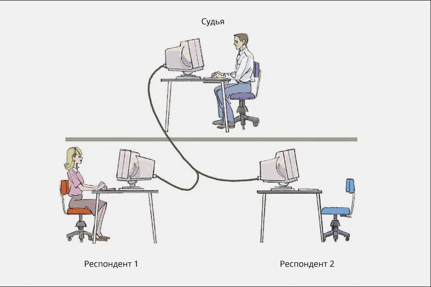

# Введение

**Искусственный интеллект** — это захватывающая научная дисциплина, которая исследует пути наделения компьютеров интеллектом, способным на творческие и аналитические задачи, подобные тем, что под силу человеку. Представьте себе компьютер, который не просто считает числа, но может понимать ваши шутки, писать стихи или создавать музыку.

Первоначально компьютеры были изобретены _Чарльзом Бэббиджем_ для выполнения строгих последовательностей операций над числами, следуя четко определённому алгоритму. В наше время компьютеры стали невероятно мощными и сложными, но основная идея осталась прежней: управляемые вычисления. Таким образом, если мы знаем точную последовательность шагов для достижения цели, то можем запрограммировать компьютер для выполнения этой задачи.

Представьте себе мир, где компьютеры понимают, что вы чувствуете, и помогают вам находить решения, которые раньше казались невозможными. Это не просто вычислительные машины, а партнёры в интеллектуальных поисках, способные открывать новые горизонты. Мир, где искусственный интеллект становится вашим верным союзником в творчестве и науке, революционируя наше представление о возможностях человека и машины.

## Слабый и сильный ИИ: что это?  

**Слабый ИИ**, также известный как узкий ИИ - представляет собой искусственный интеллект, ограниченный определённым набором задач и функциональностей.

Это вид ИИ, который разрабатывается для выполнения конкретных задач, используя продвинутые алгоритмы, но без способности охватывать весь спектр когнитивных функций, присущих человеку. Например, голосовые помощники, такие как Siri, Алиса или Маруська, являются примерами слабого ИИ. Они выполняют определенные функции в рамках заранее заданных параметров и часто имеют заранее запрограммированные ответы на запросы.

**Сильный ИИ** — это концепция машинного интеллекта, который может достигнуть уровня человеческого сознания. Такие машины способны не только выполнять сложные задачи, но и самостоятельно мыслить и принимать решения, как это делает человек.

Сильный ИИ относится к системам и программам, обладающим собственной мыслительной способностью, способным к самосознанию и автономному решению задач. Алгоритмы сильного ИИ позволяют этим системам адаптироваться к разнообразным ситуациям и принимать решения без вмешательства человека.

|                                                           Слабый ИИ                                                            |                                                    Сильный ИИ                                                     |
| :----------------------------------------------------------------------------------------------------------------------------: | :---------------------------------------------------------------------------------------------------------------: |
|                           Не обладает самосознанием и широкими когнитивными способностями человека.                            |                        Машины, обладающие человеческим интеллектом, сознанием и эмоциями.                         |
| Предназначен для выполнения узкоспециализированных задач по решению проблем или рассуждениям значительно быстрее, чем человек. | Цель создать искусственный интеллект, который можно считать равным человеческому по уровню сознания и интеллекта. |
|                                 Выполняет конкретные задачи по рассуждению и решению проблем.                                  |                   Может решать разнообразные проблемы и разрабатывать новые подходы к задачам.                    |

## Тест Тьюринга

**Тест Тьюринга**— это способ оценки, может ли компьютер мыслить, как человек.

Назван в честь британского ученого _Алана Тьюринга_, он предполагает, что компьютер демонстрирует искусственный интеллект, если способен имитировать человеческие ответы так, что человек не отличает их от ответов другого человека.

Этот тест остаётся одним из основных критериев для определения уровня развития ИИ.

### Что представляет из себя тест Тьюринга?

В оригинальном тесте Тьюринга участвуют три терминала:
1.Исследователь, задающего вопросы
2.Человека
3.Компьютер
Исследователь, используя текстовое общение, пытается определить, кто из респондентов — человек, а кто — машина. Если компьютер способен убедительно имитировать человеческие ответы так, что исследователь не может его отличить от человека, считается, что тест пройден.

