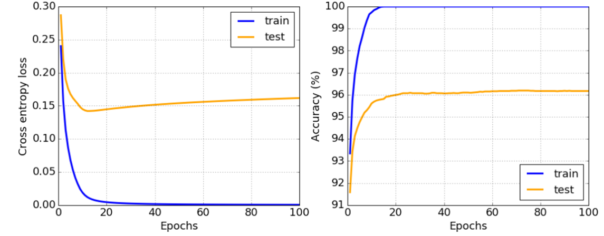

# Современные фреймворки для построения нейронных сетей
Хотя библиотека numpy может справиться с первой частью задачи, нам необходим механизм для вычисления градиентов. В фреймворке, который мы разрабатывали в предыдущем разделе, все функции производных приходилось программировать вручную в методе `backward`, который выполняет обратное распространение ошибки. В идеале фреймворк должен предоставлять возможность вычислять градиенты для любого выражения, которое мы можем определить.

Другим важным моментом является возможность выполнения вычислений на GPU или других специализированных вычислительных устройствах, таких как TPU. Обучение глубоких нейронных сетей требует значительных вычислительных ресурсов, и возможность параллелить эти вычисления на GPU имеет большое значение.

    ✅ Термин «параллелить» означает распределение вычислений между несколькими устройствами.

На данный момент два самых популярных фреймворка для нейронных сетей — это TensorFlow и PyTorch. Оба предлагают низкоуровневые API для работы с тензорами как на CPU, так и на GPU. Поверх этих API существуют более высокоуровневые интерфейсы: Keras для TensorFlow и PyTorch Lightning для PyTorch.

| Низкоуровневый API  | TensorFlow | PyTorch |
|---------------------|------------|---------|
| Высокоуровневый API | Keras      | PyTorch Lightning |

Низкоуровневые API в обоих фреймворках позволяют строить так называемые вычислительные графы. Этот граф определяет, как вычисляется выходное значение (обычно функция потерь) на основе заданных входных параметров, и может быть направлен для вычислений на GPU, если он доступен. Есть функции для дифференцирования этого графа и вычисления градиентов, которые затем используются для оптимизации параметров модели.

Высокоуровневые API рассматривают нейронные сети как последовательность слоев, что значительно упрощает построение большинства нейронных сетей. Обучение модели обычно сводится к подготовке данных и вызову функции fit для выполнения работы.

Высокоуровневый API позволяет быстро построить типичные нейронные сети, не беспокоясь о многих деталях. В то же время низкоуровневые API предоставляют больше контроля над процессом обучения, поэтому они часто используются в исследованиях, когда разрабатываются новые архитектуры нейросетей.

Важно также понимать, что можно использовать оба API вместе. Например, можно разработать собственную архитектуру слоя с использованием низкоуровневого API и затем использовать ее в более крупной сети, построенной и обученной с помощью высокоуровневого API. Или можно определить сеть с использованием высокоуровневого API как последовательности слоев и затем применить свой собственный низкоуровневый цикл обучения для оптимизации. Оба API используют одинаковые базовые концепции и разработаны так, чтобы хорошо работать вместе.

## TensorFlow

***TensorFlow*** — это одна из самых популярных библиотек для машинного обучения и глубокого обучения. Она была разработана Google и поддерживает как обучение, так и выполнение нейронных сетей на различных платформах, включая мобильные устройства. TensorFlow предоставляет широкий спектр инструментов и API, которые позволяют создавать модели любой сложности, от простых линейных регрессий до сложных свёрточных и рекуррентных нейронных сетей.

Пример кода на TensorFlow:
```Python
import tensorflow as tf

# Создание простой модели
model = tf.keras.models.Sequential([
    tf.keras.layers.Dense(128, activation='relu'),
    tf.keras.layers.Dense(10, activation='softmax')
])
# Компиляция модели
model.compile(optimizer='adam',
              loss='sparse_categorical_crossentropy',
              metrics=['accuracy'])
# Обучение модели
model.fit(x_train, y_train, epochs=5)
```
***TensorFlow*** также включает в себя TensorBoard, инструмент для визуализации и отладки моделей, который позволяет отслеживать метрики обучения, визуализировать графы вычислений и анализировать данные. Это делает TensorFlow мощным инструментом для разработки и отладки моделей машинного обучения.

## PyTorch

***PyTorch*** — это библиотека для глубокого обучения, разработанная Facebook. Она особенно популярна в академических кругах благодаря своей гибкости и удобству использования. PyTorch позволяет легко создавать и отлаживать сложные модели, предоставляя интуитивно понятный интерфейс и динамическое вычисление графов, что упрощает процесс отладки и экспериментов.

Пример кода на PyTorch:
```Python
import torch
import torch.nn as nn
import torch.optim as optim

# Определение модели
class SimpleModel(nn.Module):
    def __init__(self):
        super(SimpleModel, self).__init__()
        self.fc1 = nn.Linear(784, 128)
        self.fc2 = nn.Linear(128, 10)

    def forward(self, x):
        x = torch.relu(self.fc1(x))
        x = self.fc2(x)
        return x
model = SimpleModel()
# Определение функции потерь и оптимизатора
criterion = nn.CrossEntropyLoss()
optimizer = optim.Adam(model.parameters(), lr=0.001)
# Обучение модели
for epoch in range(5):
    for data in trainloader:
        inputs, labels = data
        optimizer.zero_grad()
        outputs = model(inputs)
        loss = criterion(outputs, labels)
        loss.backward()
        optimizer.step()
```
***PyTorch*** также поддерживает интеграцию с другими библиотеками и инструментами, такими как NumPy и SciPy, что делает его удобным для использования в научных исследованиях и разработке прототипов.

## Обучение

Вы можете выбрать предпочитаемый фреймворк и работать только с соответствующими notebook. Если вы не уверены, какой фреймворк выбрать, прочитайте несколько обсуждений по теме PyTorch против TensorFlow в интернете. Также можно ознакомиться с обоими фреймворками, чтобы лучше понять их особенности.

Когда это возможно, мы будем использовать высокоуровневые API для упрощения процесса. Однако мы считаем важным понять, как нейросети работают с нуля, поэтому в начале курса мы начнем с работы с низкоуровневым API и тензорами. Если же вы хотите быстрее начать и не тратить много времени на изучение этих деталей, вы можете пропустить их и перейти сразу к notebook с использованием высокоуровневого API.

## ✍️ **Упражнения: Фреймворки**

Продолжаем обучение используя TensorFlow+Keras Notebook:
| Низкоуровневый API  | TensorFlow+Keras Notebook |
|---------------------|:---:|
| Высокоуровневый API | Keras                     |

После освоения фреймворков мы повторим понятие переобучения.


# Переобучение (overfitting)

***Переобучение*** — это важное явление в машинном обучении, понимание которого критично для успешной разработки моделей.
Представьте задачу, в которой требуется приблизить зависимость между несколькими точками. Ниже показаны два примера аппроксимации 5 точек (отмечены крестиками на графиках):

 | 
-------------------------|--------------------------
**Простая линейная модель, 2 параметра** | **Сложная нелинейная модель, 7 параметров**
Ошибка на обучении = 5.3 | Ошибка на обучении = 0
Ошибка на валидации = 5.1 | Ошибка на валидации = 20

* Слева показана простая линейная модель, которая довольно точно отражает распределение точек. Параметров у модели немного, и этого достаточно, чтобы уловить основную закономерность данных.
* Справа показана более сложная модель с большим количеством параметров. Модель подстроена под каждый пример из обучающей выборки, что приводит к нулевой ошибке на обучении, но из-за этого не может понять общую структуру данных. Это приводит к высокой ошибке на валидации.

Поэтому важно подобрать модель с достаточной сложностью, чтобы уловить основные закономерности, но при этом не перестараться.

## Причины переобучения

  * Недостаточное количество данных для обучения
  * Чрезмерно сложная модель
  * Высокий уровень шума в данных

## Признаки переобучения

На графике выше можно увидеть, что переобучение проявляется в низкой ошибке на обучающей выборке и высокой ошибке на валидации. Как правило, по мере обучения ошибка на обучении и валидации уменьшается, но затем ошибка на валидации может остановиться и начать расти. Это сигнал, что модель начинает запоминать данные, а не обучаться на общих закономерностях. В этот момент стоит либо остановить обучение, либо зафиксировать текущую версию модели.



## Методы предотвращения переобучения

Если модель начинает переобучаться, можно попробовать следующие методы:

 * Увеличить объем данных для обучения
 * Уменьшить сложность модели

## Переобучение и баланс между смещением и дисперсией

Переобучение связано с более общей проблемой в статистике, известной как [компромисс между смещением и дисперсией](https://ru.wikipedia.org/wiki/Компромисс_смещения_и_дисперсии). В нашем случае ошибки модели можно разделить на два типа:

* **Ошибка смещения** возникает, когда модель не способна уловить закономерности в данных. Это может происходить, если модель слишком простая (что приводит к **недообучению**).
* **Ошибка дисперсии** возникает, если модель начинает учитывать шум в данных как значимую закономерность (**переобучение**).

Во время обучения модель сначала уменьшает ошибку смещения, приближаясь к данным, но по мере усложнения начинает возрастать ошибка дисперсии. Важно своевременно остановить обучение — вручную или с помощью регуляризации — чтобы избежать переобучения и достичь оптимального баланса.
