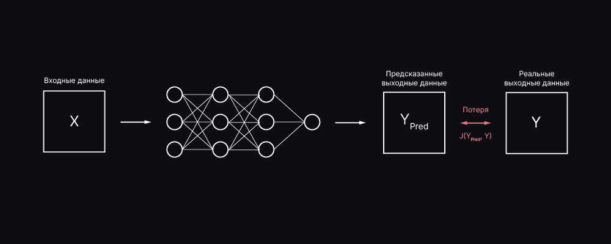

# Нейронные сети для начинающих

**_Искусственная нейронная сеть (ИНС)_** — это математическая модель, вдохновленная принципами работы биологических нейронных систем, предназначенная для решения задач, таких как классификация, регрессия, кластеризация и др. ИНС представляет собой последовательность слоев нейронов, где каждый нейрон выполняет определенную математическую операцию над входными данными.

## Основные элементы нейронной сети:

1. Входной слой (Input layer):
   - Этот слой принимает данные, которые поступают в модель. Каждое значение векторного представления данных (например, пиксели изображения, признаки для классификации) становится входом для сети.
2. Скрытые слои (Hidden layers):
   - Один или несколько слоёв, которые обрабатывают данные. В каждом скрытом слое нейроны выполняют вычисления, такие как взвешенные суммы входных данных, и применяют функции активации для добавления нелинейности в модель. Количество скрытых слоёв и нейронов в них зависит от сложности задачи.
3. Выходной слой (Output layer):
   - Этот слой даёт результат работы нейронной сети. Он может содержать один или несколько нейронов, в зависимости от задачи. Например, для бинарной классификации это может быть один нейрон с сигмоидной функцией активации, а для многоклассовой классификации — несколько нейронов с softmax активацией.
      

1. Входные данные
2. Нейрон
3. Функция активации
4. Выходные данные (Результат)

## Модель нейрона

**Нейрон** представляет собой клетку, которая получает сигналы через свои входы (аксоны) и передает их через выход (дендрит). Аксоны и дендриты способны проводить электрические импульсы, а сила связи между ними может варьироваться в зависимости от уровня нейромедиаторов, которые регулируют проводимость этих связей.

Простейшая математическая модель нейрона состоит из нескольких входных значений X1,...,XN​, одного выходного значения Y и **весов** W1,...,WN​, которые регулируют силу связи между входами и выходом. Выход Y получается путем вычисления взвешенной суммы входов, после чего к результату применяется активационная функция f, которая делает модель нелинейной.

**_Веса (Weights):_**  
Каждый вход в нейрон связан с весом, который определяет важность этого входа. Во время обучения веса обновляются, чтобы минимизировать ошибку сети.

## Разновидности слоёв Нейронных сетей

1. _Линейный слой (или dense layer)_ — это линейное преобразование над входными данными. Его обучаемые параметры — это матрица W и вектор смещения b. Формула преобразования данных выглядит так:

   - x↦xW+b($\ W∈R^{d×k},x∈R^d,b∈R^k$).
      Такой слой преобразует d-мерные векторы в k-мерные.

2. _Функция активации_ — это нелинейное преобразование, которое применяется поэлементно к входным данным. Благодаря функциям активации нейронные сети могут создавать более сложные и информативные представления данных, применяя нелинейности. Примеры популярных функций активации:
   - ReLU (rectified linear unit):
     - $\ {ReLU(x)} = {max(0,x)}$
   - Сигмоида:
     - $\ {σ(s)} = 1 / 1+e^s$

Функции активации позволяют сети работать с более сложными зависимостями, чем просто линейные преобразования. О более глубоких видах и свойствах функций активации мы вернёмся позже.

## Потери (Loss function):

Функция потерь (Loss Function, Cost Function, Error Function, часто обозначаемая как \( J \)) — это часть программного кода, используемая для оптимизации алгоритмов машинного обучения. Значение, которое вычисляется с помощью этой функции, называется «потерей» модели.

Функция потерь предоставляет нейронной сети необходимую гибкость для настройки и обучения, а также определяет, как выходные данные модели соотносятся с истинными значениями.

Нейронные сети могут решать различные задачи, от предсказания непрерывных значений, таких как расходы на месяц, до бинарной классификации (например, различение кошек и собак). Для каждой из этих задач необходимы разные типы функций потерь, поскольку форма выходных данных будет варьироваться.

С простой точки зрения, функция потерь — это математическая зависимость, которая принимает два аргумента:

- Прогнозируемые значения (предсказания модели)
- Истинные значения (реальные ответы)

Эта функция, по сути, вычислит, насколько хорошо работает наша модель, сравнив то, что модель прогнозирует, с фактическим значением, которое она выдает. Если Ypred очень далеко от Yi, значение потерь будет очень высоким. Однако, если оба значения почти одинаковы, значение потерь будет очень низким. Следовательно, нам нужно сохранить функцию потерь, которая может эффективно наказывать модель, пока та обучается на Тренировочных данных (Train Data).

## Термины которые нам пригодятся

Дифференцируемая функция — это ключевое свойство, которое позволяет использовать методы оптимизации, такие как градиентный спуск, для обучения модели. Дифференцируемость важна для вычисления производных, необходимых для обновления весов сети.

Параметрические преобразования — это преобразования, параметры которых можно настроить в процессе обучения. В случае нейронных сетей параметры — это веса и смещения нейронов, которые настраиваются с помощью обучающих алгоритмов.

Обучение end-to-end — означает, что вся нейронная сеть может быть обучена на одном наборе данных, с прямой связью между входными и выходными данными. Это позволяет улучшать производительность модели без необходимости разрабатывать отдельные этапы предобработки или подбора признаков.

## В этом разделе мы узнаем о следующих темах:

1. **_Перцептрон_** — одна из первых моделей нейронных сетей для классификации с двумя классами.
2. **_Фреймворки нейронных сетей_**, включая практическую работу с Keras/TensorFlow.
3. **_Переобучение (overfitting)_** — проблемы, связанные с излишней подгонкой модели под тренировочные данные, и методы их решения.
