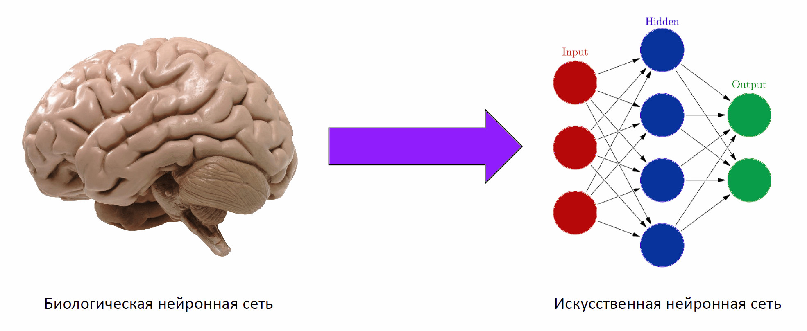
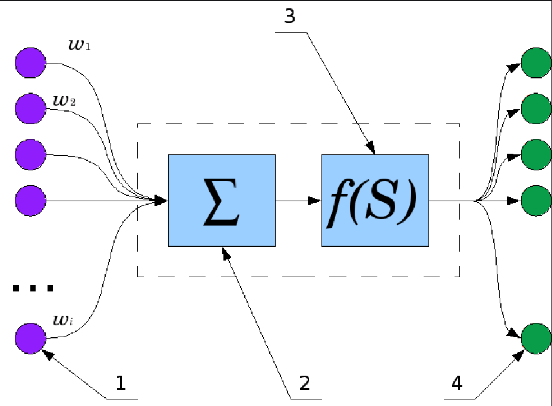

# Нейронные сети для начинающих

**_Искусственная нейронная сеть (ИНС)_** — это математическая модель, вдохновленная принципами работы биологических нейронных систем, предназначенная для решения задач, таких как классификация, регрессия, кластеризация и др. ИНС представляет собой последовательность слоев нейронов, где каждый нейрон выполняет определенную математическую операцию над входными данными.

## Разновидности слоёв Нейронных сетей

1. _Линейный слой (или dense layer)_ — это линейное преобразование над входными данными. Его обучаемые параметры — это матрица WW и вектор смещения bb. Формула преобразования данных выглядит так:
   x↦xW+bx↦xW+b (W∈Rd×k,x∈Rd,b∈RkW∈Rd×k,x∈Rd,b∈Rk).
   Такой слой преобразует dd-мерные векторы в kk-мерные.

2. _Функция активации_ — это нелинейное преобразование, которое применяется поэлементно к входным данным. Благодаря функциям активации нейронные сети могут создавать более сложные и информативные представления данных, применяя нелинейности. Примеры популярных функций активации:
   - ReLU (rectified linear unit):
   * ReLU(x)=max(0,x)
   - Сигмоида:
     - $\ σ(s) = 1 over 1 + e^-s$

Функции активации позволяют сети работать с более сложными зависимостями, чем просто линейные преобразования. О более глубоких видах и свойствах функций активации мы вернёмся позже.

## Термины которые нам пригодятся

Дифференцируемая функция — это ключевое свойство, которое позволяет использовать методы оптимизации, такие как градиентный спуск, для обучения модели. Дифференцируемость важна для вычисления производных, необходимых для обновления весов сети.

Параметрические преобразования — это преобразования, параметры которых можно настроить в процессе обучения. В случае нейронных сетей параметры — это веса и смещения нейронов, которые настраиваются с помощью обучающих алгоритмов.

Обучение end-to-end — означает, что вся нейронная сеть может быть обучена на одном наборе данных, с прямой связью между входными и выходными данными. Это позволяет улучшать производительность модели без необходимости разрабатывать отдельные этапы предобработки или подбора признаков.

## Модель нейрона

Нейрон представляет собой клетку, которая получает сигналы через свои входы (аксоны) и передает их через выход (дендрит). Аксоны и дендриты способны проводить электрические импульсы, а сила связи между ними может варьироваться в зависимости от уровня нейромедиаторов, которые регулируют проводимость этих связей.

Простейшая математическая модель нейрона состоит из нескольких входных значений X1,...,XN​, одного выходного значения Y и весов W1,...,WN​, которые регулируют силу связи между входами и выходом. Выход Y получается путем вычисления взвешенной суммы входов, после чего к результату применяется активационная функция f, которая делает модель нелинейной.

1. Входные данные
2. Нейрон
3. Функция активации
4. Выходные данные (Результат)

## В этом разделе мы узнаем о следующих темах:

1. **_Перцептрон_** — одна из первых моделей нейронных сетей для классификации с двумя классами.
2. **_Фреймворки нейронных сетей_**, включая практическую работу с PyTorch и Keras/TensorFlow.
3. **_Переобучение (overfitting)_** — проблемы, связанные с излишней подгонкой модели под тренировочные данные, и методы их решения.
